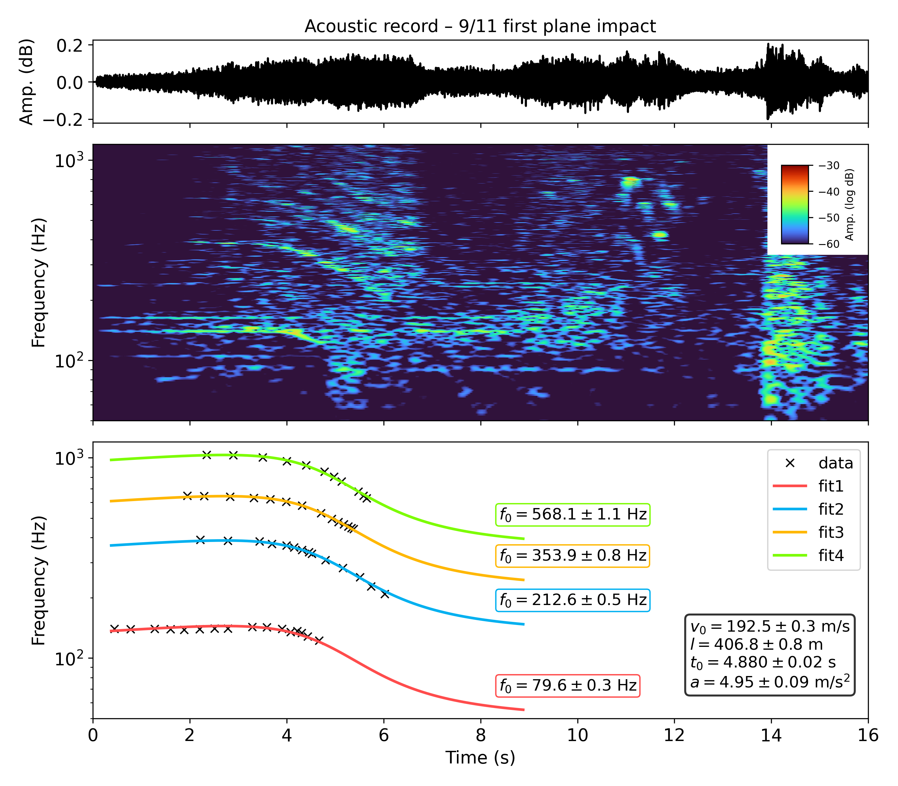
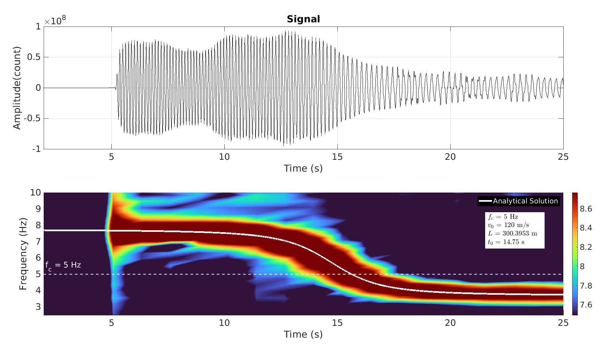

# Decoding Complex Flight Kinematics 
## Overview

Airplanes create sound and ground vibrations that change in frequency as they move—much like the changing pitch of a passing siren.  By analyzing these Doppler patterns recorded by **microphones or seismometers**, or even extracted from **video data**, we can infer not only an aircraft’s **speed and direction**, but also its **acceleration** and **turning motion**.  


This work develops a comprehensive method to extract such detailed flight behavior and validates it using both **field data** and **historical footage**, including the **September 11, 2001 aircraft impact** on the World Trade Center.  
The results demonstrate how existing **seismic and acoustic data** can be leveraged to monitor and interpret aircraft activity.


## Complex Kinematic Modeling

We introduce **complex kinematic source modeling** to simulate realistic aircraft trajectories, including:

- Curved flight paths (e.g., turning maneuvers)
- Variable-speed motion with acceleration or deceleration

These kinematic models are implemented in MATLAB (`./modeling/complex_kinematic_modeling/doppler_fwd_chgdirection.m`, `./modeling/complex_kinematic_modeling/doppler_fwd_acc.m`).

---

## 9/11 Aircraft Inversion

As an advanced application, this work includes **Inversion of the 9/11 aircraft kinematic parameters**, using:

- **Observed frequency–time curves** extracted from the original footage of 9/11 event.
- **Forward simulation** based on `doppler_fwd_acc.m`.
- **MCMC inversion** to estimate the aircraft’s speed, distance, and acceleration parameters.

This inversion demonstrates how acoustic data can recover **flight kinematics** with high precision highlighting the potential of seismoacoustic monitoring for aviation safety, airspace management, and forensic event reconstruction.

**Example:**  
The 9/11 aircraft inversion can be reproduced by running the MATLAB script:

```bash
./inversion/complex_kinematic/MCMC_911_overtone.m
```




## Simulation Results

###  Wavefield Simulation

The wavefield generated by an airplane-like moving source, showing pressure field evolution:


---

###  Waveform and Time-Frequency Analysis

Below is a representative station's waveform and its time-frequency representation:



---

### Model Fit to Observed Frequencies

The following figure shows the comparison between the observed frequency-time points and the fitted model result:


## Citation

**Meng, H., & Ben-Zion, Y. (2018).**  
*Characteristics of Airplanes and Helicopters Recorded by a Dense Seismic Array Near Anza, California.*  
_Journal of Geophysical Research: Solid Earth, 123_, 4783-4797.  
[https://doi.org/10.1029/2017JB015240](https://doi.org/10.1029/2017JB015240)

**Pan, Y. (2025, October).** Aircraft motion signatures: Seismic and acoustic data (version v2) [**dataset**]. Zenodo.  
doi: [10.5281/zenodo.17310280](https://doi.org/10.5281/zenodo.17310280)  

> **Note:** The dataset provided by Pan, Y. includes the **seismic waveforms** and **two-dimensional finite-difference simulation code (C-version)**


