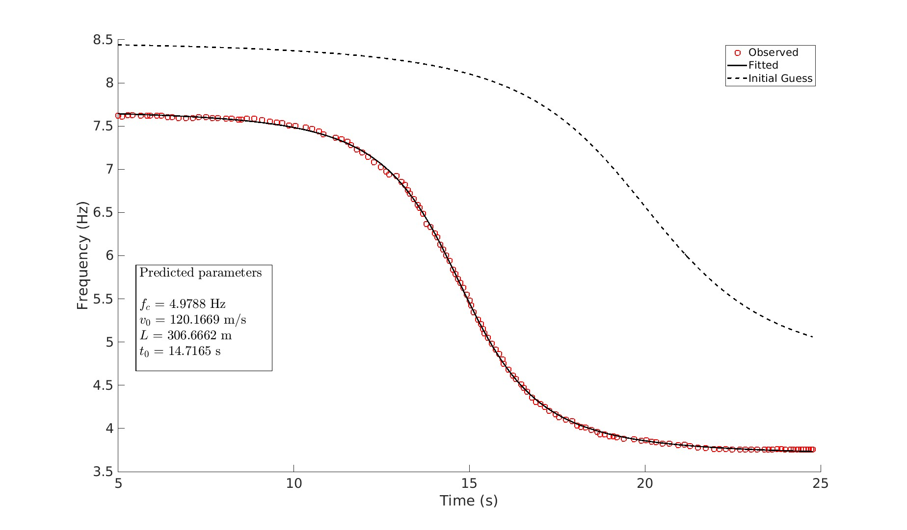

# Airplane Signal Modeling and Inversion 
## Overview

Airplanes create sound and ground vibrations that change in frequency as they move—much like the changing pitch of a passing siren.  
By analyzing these Doppler patterns recorded by **microphones or seismometers**, or even extracted from **video data**, we can infer not only an aircraft’s **speed and direction**, but also its **acceleration** and **turning motion**.  

This work develops a comprehensive method to extract such detailed flight behavior and validates it using both **field data** and **historical footage**, including the **September 11, 2001 aircraft impact** on the World Trade Center.  
The results demonstrate how existing **seismic and acoustic data** can be leveraged to monitor and interpret aircraft activity.

## Complex Kinematic Modeling

We introduce **complex kinematic source modeling** to simulate realistic aircraft trajectories, including:

- Curved flight paths (e.g., turning maneuvers)
- Variable-speed motion with acceleration or deceleration

These kinematic models are implemented in MATLAB (`doppler_fwd_chgdirection.m`, `doppler_fwd_acc.m`).

Example:  
A turning source with time-dependent velocity and emission angle can reproduce frequency-modulated Doppler patterns observed in real aircraft recordings.

---

## 9/11 Aircraft Inversion

As an advanced application, this work includes **Inversion of the 9/11 aircraft kinematic parameters**, using:

- **Observed frequency–time curves** extracted from the original footage of 9/11 event.
- **Forward simulation** based on `doppler_fwd_acc.m`.
- **MCMC inversion** to estimate the aircraft’s speed, distance, and acceleration parameters.

This inversion demonstrates how acoustic data can recover **flight kinematics** with high precision highlighting the potential of seismoacoustic monitoring for aviation safety, airspace management, and forensic event reconstruction.

## Simulation Results

###  Wavefield Simulation

The wavefield generated by an airplane-like moving source, showing pressure field evolution:

---

###  Waveform and Time-Frequency Analysis

Below is a representative station's waveform and its time-frequency representation:

---

### Model Fit to Observed Frequencies

The following figure shows the comparison between the observed frequency-time points and the fitted model result:

## Citation

**Meng, H., & Ben-Zion, Y. (2018).**  
*Characteristics of Airplanes and Helicopters Recorded by a Dense Seismic Array Near Anza, California.*  
_Journal of Geophysical Research: Solid Earth, 123_, 4783-4797.  
[https://doi.org/10.1029/2017JB015240](https://doi.org/10.1029/2017JB015240)

